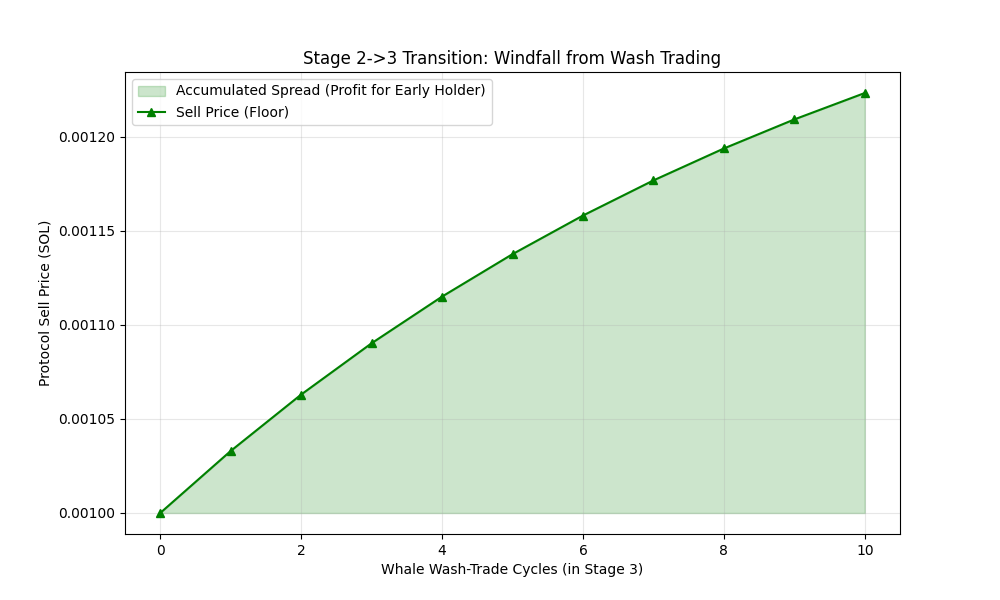

# Nautilus Protocol: Technical Q&A & Deep Dive

This document compiles technical inquiries and findings regarding the Nautilus Protocol's economic model, implementation, and edge-case simulations.

---

## 1. The Bootstrap Phase (Stages 1-2)

### Q: What is the reasoning for the bootstrap phase?
**A:** The Bootstrap Phase is a **bot-resistance mechanism**. In standard bonding curves, stages advance based on cumulative volume, which a bot can "speed-run" via wash trading (buying and selling repeatedly). Nautilus prevents this in Stages 1 and 2 by tying advancement to **Net Circulating Supply**. 

**Key Objectives:**
*   **Proof of Community:** Requires the community to collectively hold 20,000 tokens to reach Stage 3.
*   **Price Gapping Prevention:** Stops manipulators from artificially inflating the price ladder before organic distribution occurs.

---

## 2. Circulation Tracking & State Logic

### Q: How is total circulation being tracked?
**A:** Circulation is tracked via the `total_sold` field in the `NautilusState` account. It is a dynamic counter:
*   **Buy:** `total_sold` increments.
*   **Sell:** `total_sold` decrements (burn).

**Transition Logic:**
*   **Bootstrap (Stage 1-2):** Uses `total_sold` (Net Supply). Wash trading results in zero net progress.
*   **Growth (Stage 3+):** Uses `stage_sold[stage]` (Cumulative Issuance). Volume advances the stage, but the 0.5% spread ensures this progress is "expensive" for manipulators.

---

## 3. The "Recovery Floor" Guarantee

### Q: Is the 1/φ floor just a theoretical maximum?
**A:** It is the **absolute mathematical minimum**. The protocol's "Proof Note" establishes that the **"Buy-only" path is the worst-case scenario.** 
*   If any selling happens at any point, the 0.5% retained spread "pads" the treasury.
*   Therefore, any real-world trading activity only serves to move the floor **higher** (safer) than the theoretical $0.618$ ratio.

---

## 4. Large Sell Orders & The Whale Dump Demo

### Q: What happens if a whale dumps a huge percentage of the supply?
**A:** In a traditional AMM, this would crash the price to near-zero. In Nautilus, **it increases the exit price for everyone else.**
*   **The Demo:** The author's `whale_dump_demo.ts` simulated an **80% supply dump** at Stage 4. 
*   **The Result:** The `sell_price` for the remaining 20% of holders actually **increased** after the dump.
*   **The Logic:** Because 0.5% of the whale's huge exit remains in the treasury while their tokens are burned, the "backing per token" for the survivors improves. This is the **"Inverse Panic"** effect.

---

## 5. Stage 2→3 Transition & "Windfall" Dynamics

### Q: Is it beneficial to buy just before the Stage 3 transition?
**A:** Yes. The shift from "Net Supply" logic to "Cumulative Logic" creates a unique opportunity. 
*   **The "Tax" on Manipulation:** Because Stage 3+ can be advanced by volume, bots often try to "speed-run" it. However, every wash trade they execute pays a 0.5% spread into the treasury.
*   **Simulation Result:** A holder who entered at the end of Stage 2 saw an **ROI of over 9,900%** when a whale attempted to speed-run Stage 3. The whale effectively subsidized the floor for the early holder.

---

## 6. Late-Stage Strategies

| Strategy | Market Condition | Execution |
|---|---|---|
| **Vol-Mining** | High "Washy" Volume | Hold through the noise to capture the 0.5% spread "tax" on every trade. |
| **Stage-Exit Snipe** | Stage is >90% full | Enter at the end of a stage to benefit from a higher `sell_price` while paying the same `buy_price`. |
| **Max-Pain Entry** | `sell / buy` ratio ≈ 0.62 | Accumulate at the mathematical floor where downside risk is minimized. |
| **Inverse Panic** | Mass sell-off | Hold through panics; as supply shrinks, the spread concentration pushes the `sell_price` up for survivors. |

---

## 7. Identified System Constraints

### The Rent Lock-in (Absolute Insolvency)
Simulation confirmed that the final ~1 token in any Nautilus instance is unredeemable. 
*   **Reason:** Solana's **Rent-Exempt Minimum** (~0.00089 SOL). 
*   **Effect:** The protocol will always retain a "residual" treasury balance, ensuring the PDA remains alive on-chain even if all users exit.
