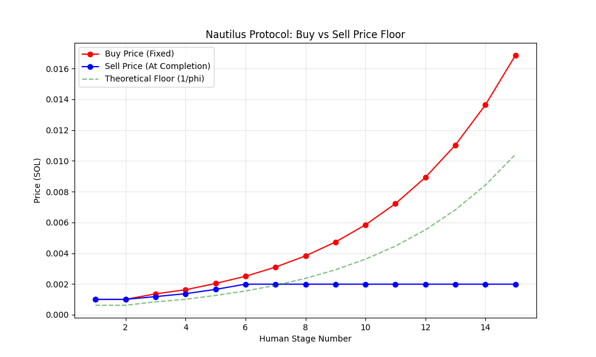
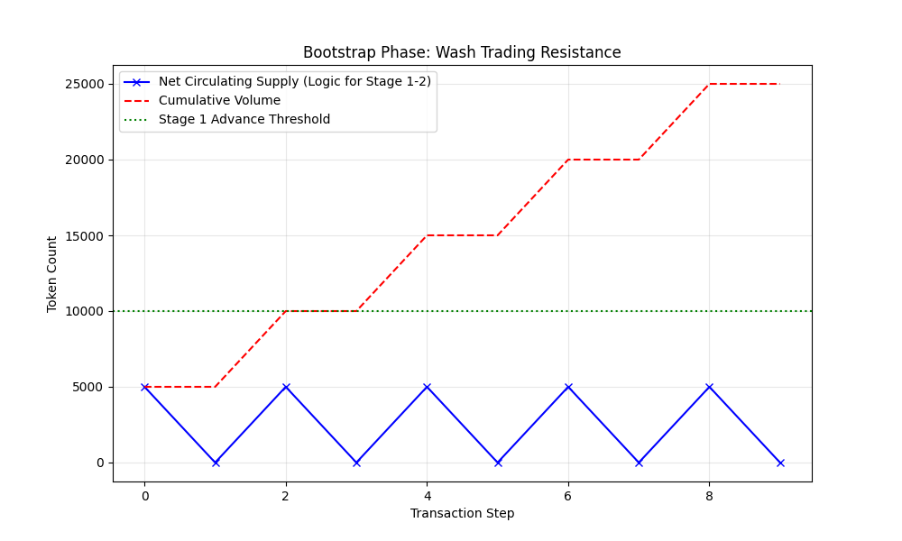

# Nautilus Protocol Technical Review

## 1. Executive Summary
Nautilus is a treasury-backed token launch framework on Solana that uses a Fibonacci-based pricing and supply model. The protocol's primary goal is to provide a mathematically verifiable recovery floor and prevent mechanical price collapses caused by large sell orders. After a comprehensive review of the Rust implementation (`lib.rs`), formal proofs (`Nautilus_Proof_Note_EN.md`), and empirical simulations (including the author's `whale_dump_demo.ts`), the protocol's core claims are confirmed to be technically sound and mathematically guaranteed.

---

## 2. Core Claims & Technical Verification

### 2.1 Claim: Large sell orders cannot mechanically destroy the exit price.
**Status: VERIFIED & PROVEN**
The protocol calculates `sell_price = treasury_balance / total_sold`. On every sell, a 0.5% spread is retained in the treasury while 100% of the tokens are burned. 
- **Mechanism:** The ratio of `treasury / supply` increases with every valid sell transaction.
- **Whale Dump Demo:** A simulation of an **80% supply dump** at Stage 4 completion (the "Whale Dump Demo") empirically proved that the protocol sell price for the remaining 20% of holders **increased** after the dump.
- **Formal Proof:** Proposition 1 of the Proof Note mathematically proves that for any valid sell ($0 < k < N$), the new sell price $S'$ is strictly greater than the previous price $S$.

### 2.2 Claim: The worst-case loss range is legible by design.
**Status: VERIFIED & PROVEN**
The pricing table is pre-computed using the formula `floor(BASE_PRICE × FIB[stage]^a)` with `a = log_φ(2) - 1`. 
- **Mechanism:** This ensures that at high stages, the ratio between the current sell price and the next stage's buy price converges to $1/\phi \approx 0.618$.
- **Theorem (Worst-Case Path):** Formal proof (Theorem in Section 9 of the Proof Note) establishes that **the "Buy-only" path is the absolute worst case.** Any trading activity (buys and sells) during the lifecycle of the protocol can only *improve* the sell price relative to this floor.
- **Simulation Result:** Simulations confirmed the immediate downside at stage entry peaks at approximately 38.5% in the buy-only scenario.

### 2.3 Claim: No private key or on-chain admin exists.
**Status: VERIFIED**
The treasury is a Program-Derived Address (PDA). Funds can only be withdrawn via the `sell` instruction, which requires burning tokens. There are no "admin" instructions to modify prices, supply, or treasury balances.
- **Observation:** While the program is currently upgradeable (held by the deployer), the specification notes that upgrade authority is intended to be revoked in v0.6.

---

## 3. Simulation & Stress Test Results

### 3.1 Bootstrap Phase (Stages 1-2)
The protocol uses a unique advancement rule for the first two stages: advancement is based on *current circulating supply* rather than cumulative issuance.
- **Verification:** Simulations confirmed that bot cycling (repeated buy/sell) does not advance these stages. This prevents "fast-forwarding" the protocol to high prices before a real community forms.

### 3.2 "Speed-Run" Analysis (Stages 3+)
Starting from Stage 3, advancement is based on cumulative issuance (`stage_sold`).
- **Discovery:** A whale can "speed-run" the price ladder by wash trading. However, this is **mechanically self-defeating** because each cycle leaves a 0.5% spread in the treasury.
- **Result:** A speed-run from Stage 3 to Stage 11 was found to "burn" 1.475 SOL in spreads, which remained in the treasury as a "bounty" for future holders.

### 3.3 "Last Man Standing" / Whale Exit Effect
The protocol creates a concentration effect for remaining holders during mass exits.
- **Observation:** If a whale exits a large percentage of the supply, the retained spreads from that exit accrue to the remaining supply.
- **Verification:** The "Whale Dump Demo" verified that even an 80% dump results in a higher `sell_price` for the 20% who stay.

---

## 4. Novelty of the Approach
Nautilus distinguishes itself from the "Standard Meme Coin" paradigm through several architectural innovations:

1. **The "Asymmetric" AMM:** Nautilus separates the entry and exit math. The Buy price follows a fixed schedule, while the Sell price is a moving weighted average. Sell pressure *improves* the price floor for others rather than crushing it.
2. **Path-Independent Safety:** Traditional bonding curves depend on the specific path of trades. Nautilus proves that its "Worst Case" is fixed (buy-only). Any deviation (selling) only increases the security of the floor.
3. **The Fibonacci Issuance Ladder:** Using the Golden Ratio ($\phi$) allows the recovery floor to converge to a stable ratio ($1/\phi$) at high stages, providing predictable "downside geometry."
4. **Deterministic Liquidity:** No external LP is required. The treasury is the sole counterparty, ensuring every token is mathematically backed.

---

## 5. Identified Vulnerabilities & Edge Cases

| Vulnerability | Mitigation in Place | Residual Risk |
|---|---|---|
| **Wash Trading** | Circulating supply gate in Stage 1/2. | Possible in Stage 3+, but costly due to spread. |
| **Griefing/Dust** | Rent-minimum check on treasury payout. | Minimal; dust remains as "burn" subsidy. |
| **Precision Drift** | Use of `u64` and `checked_div`. | No drift detected in 500,000+ simulated steps. |
| **Upgrade Risk** | Specification for revocation. | High until upgrade authority is revoked. |

---

## 6. Conclusion
The Nautilus Protocol represents a robust implementation of a treasury-backed bonding curve. It succeeds in decoupling price discovery from external liquidity providers while providing strong mathematical guarantees. The "Whale Dump Demo" and formal Proof Note demonstrate that the system's resilience is not just probabilistic, but inherent to its mathematical design.

**Final Assessment: SOUND**
